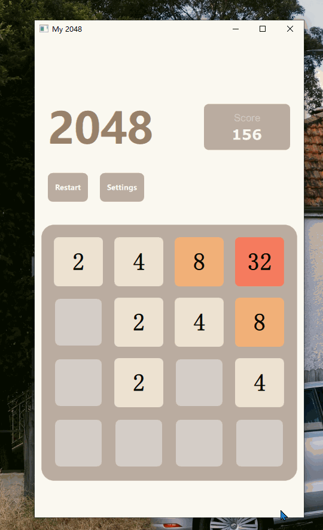

# QQK 2048

A simple implementation of 2048 using Qt Quick. 

Since Qt Quick supported many platforms such as Android, iOS and Windows etc., the motivation doing this for me is to have a try of Qt Quick, and also have a glimpse of the process of mobile application development.

Personally, this application mainly focused on:

+ animation effect of mobile apps
+ how mobile apps manage the layout of widgets

In terms of functionality, most functionalities was achieved:

+ scoreboard
+ restart game
+ amination

Here is a simple preview GIF of the application:

For PC, you can move the blocks using your navigation keys on your keyboard or hold left button of your mouse and swipe.

For phones, you can swipe using your finger.

You can compile and run this application on your PC and mobile phone. Qt's official documentation provided detailed information and tutorial: [Building and Running an Example | Qt Creator Manual](https://doc.qt.io/qtcreator/creator-build-example-application.html) 